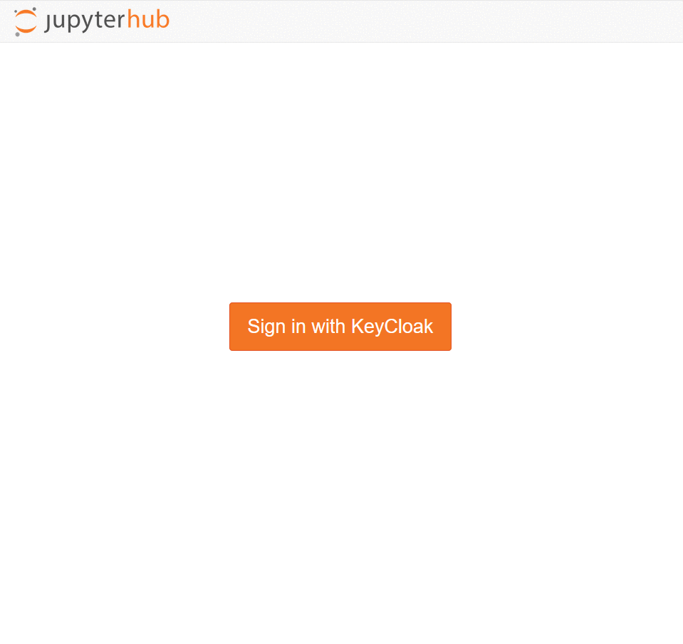

# PMD onboarding workshop: pyiron workflows
The repository of the PMD onboarding workshop. The repository includes the pyiron workflow notebooks presented in the afternoon session.  

## mybinder link  

## Content

| notebooks | Description | path|
|-----|------------|------------|
| 0_opening_notebook.ipynb | introduction to jupyterlab environement | . |
| 1_1_intro.ipynb | introduction to pyiron workflows via lammps simulation| 1_1_intro_pyiron_building_blocks | 
| 1_2_import_project.ipynb | imports an exported project | 1_2_import_proj/ |
| 2_0_custom_python_job.ipynb | Defining custom classes for python jobs | 2_customized_job/ |
| 2_1_custom_bash_job.ipynb | Defining custom classes for non-python jobs | 2_customized_job/ |
| 3_lammps-damask-workflow.ipynb | lammps-damask workflow to obtain macroscopic response based on atomistic properties | 3_lammps_damask_workflow/ | 
| 4_data_mining.ipynb | introduction to data mining capabilities in pyiron | 4_data_mining/ |  
## login to the server  

